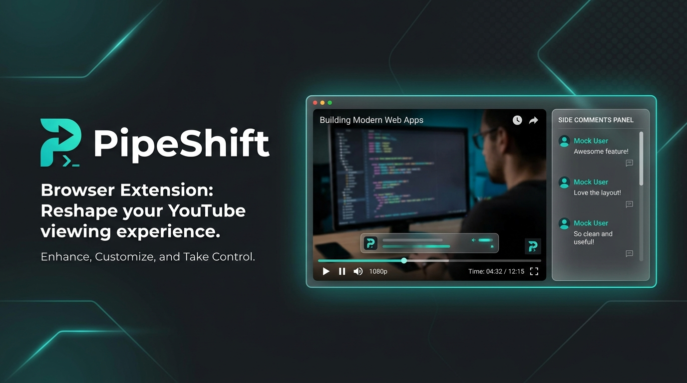

<p align="center">
  
</p>

<p align="center">
  
</p>

<h1 align="center">PipeShift</h1>

<p align="center">
  <strong>A precision-engineered browser extension that reshapes the YouTube watching experience.</strong><br/>
  Soft dark theme · Side comments panel · Distraction-free feed — zero permissions, zero tracking.
</p>

<p align="center">
  <a href="#install"></a>
  <a href="#install"></a>
  
  
  
</p>

---

## Why PipeShift?

YouTube's default interface has visual friction — harsh pure-black dark mode, comments buried below the fold, and a category chip bar that adds clutter without value. PipeShift surgically fixes these three pain points with clean CSS overrides and lightweight DOM manipulation, while requesting **zero browser permissions**.

---

## ✦ Features

### 🎨 Refined Dark Theme
Replaces YouTube's harsh `#0f0f0f` pitch-black with a carefully chosen `#191919` soft charcoal palette. Every surface — navigation bar, sidebar, video page, menus, scrollbars, and search results — is recolored for a cohesive, eye-friendly experience.

> Only activates when YouTube's built-in dark mode is enabled (`html[dark]`). Touches **only** background colors — never alters text, icons, or YouTube's functionality.

### 💬 Side Comments Panel
Moves the comments section from below the video into a **sticky, scrollable sidebar** alongside the player. Comments load automatically via a scroll-trigger technique and animate in with a smooth CSS transition.

**Technical highlights:**
- SPA-aware navigation via YouTube's native `yt-navigate-finish` event
- Smart layout detection for theater mode, miniplayer, and standard views
- Playlist auto-collapse on load using YouTube's own collapse button
- Graceful fallback on narrow viewports (`< 1100px`)

### 🚫 Category Chip Removal
Completely removes the feed filter chip bar (`ytd-feed-filter-chip-bar-renderer`), the frosted glass overlay, and the sticky header row — reclaiming vertical space on the home feed.

**Implementation:** Dual approach with CSS (`display: none`) and a debounced `MutationObserver` for chips injected after initial render.

### 🖥️ Clean Fullscreen
Hides YouTube's `ytd-popup-container` overlay elements during fullscreen playback, preventing UI pop-ups from breaking immersion.

---

## Architecture

```
PipeShift/
├── manifest.json              # MV3 manifest — Chrome + Firefox compatible
├── css/
│   ├── theme.css              # Dark grey color overrides (CSS custom properties)
│   ├── side-comments.css      # Sidebar layout, scrollable comments card, animations
│   └── hide-chips.css         # Category bar removal
├── js/
│   ├── side-comments.js       # SPA-aware comment relocation + playlist collapse
│   ├── hide-chips.js          # MutationObserver-based chip removal
│   ├── fullscreen.js          # Popup container suppression in fullscreen
│   └── playlist-hide.js       # Prevents playlist flash before side-comments init
├── icons/
│   ├── icon16.png
│   ├── icon48.png
│   └── icon128.png
└── assets/
    └── banner.jpg
```

**No background scripts. No service worker. No storage. No network requests.**  
The entire extension runs as content scripts injected into `youtube.com` — nothing else.

---

## Technical Decisions

| Decision | Rationale |
|---|---|
| Content scripts only | Eliminates background resource usage; the extension is effectively "free" when not on YouTube |
| `yt-navigate-finish` event | YouTube's own SPA navigation event — more reliable than URL polling or `popstate` |
| `document_start` injection | Theme CSS applies before first paint, preventing flash of unstyled content |
| Debounced `MutationObserver` | Chip removal uses `requestAnimationFrame` batching to avoid layout thrashing |
| `innerHTML.length > 100` check | Ensures comments are genuinely loaded, not just an empty DOM skeleton |
| CSS custom properties | Overrides YouTube's own `--yt-spec-*` variables for consistent theming |
| Zero permissions | No `tabs`, `storage`, `activeTab`, or host permissions — maximum user trust |

---

## Install

### Firefox Add-on Store

<p align="center">
  <a href="https://addons.mozilla.org/en-US/firefox/addon/pipeshift/"></a>
</p>

### Manual Installation (Any Chromium Browser)

1. **Download** — Click the green **Code** button → **Download ZIP** → Extract to a permanent location
2. Navigate to your browser's extensions page (`chrome://extensions` or `edge://extensions`)
3. Enable **Developer mode** (toggle in top-right)
4. Click **Load unpacked** and select the extracted `PipeShift` folder

> **Note:** Don't delete the extracted folder — the browser loads from it directly.  
> To update, replace the folder contents. The browser reloads automatically if the path hasn't changed.

---

## Compatibility

| Browser | Method | Status |
|---|---|---|
| Firefox 140+ | Add-on Store | ✅ Published |
| Chrome | Manual load | ✅ Supported |
| Edge | Manual load | ✅ Supported |
| Brave | Manual load | ✅ Supported |
| Opera | Manual load | ✅ Supported |
| Arc | Manual load | ✅ Supported |

**Requires:** YouTube's built-in dark mode must be enabled for the theme overrides to activate.

---

## Privacy & Security

```
Permissions requested:     0
Data collected:            None
Network requests made:     None
Background processes:      None
Third-party dependencies:  None
```

PipeShift is fully transparent — the entire source code is in this repository. The extension cannot read data from any site other than `youtube.com`, and it makes no external connections of any kind.

Firefox's mandatory data disclosure (`data_collection_permissions`) explicitly declares: **`"required": ["none"]`**.

---

## Acknowledgments

### [Sidesy](https://github.com/abinjohn123/sidesy) by [@abinjohn123](https://github.com/abinjohn123)

The side comments feature was made possible by studying **Sidesy** — the original extension that pioneered moving YouTube comments to a sidebar. Key technical insights adopted from Sidesy's approach:

- `getElementById('comments')` over complex query selectors
- `innerHTML.length > 100` to verify comments are genuinely loaded
- `yt-navigate-finish` as the canonical SPA navigation event
- Cleanup should only disconnect observers — never manipulate DOM during navigation

Sidesy offers additional features including a toggle button, keyboard shortcuts, and scroll position preservation. Check it out:

<p>
  <a href="https://github.com/abinjohn123/sidesy"><strong>GitHub</strong></a> · 
  <a href="https://chromewebstore.google.com/detail/mlceikceecooilkgiikkopipedhjjech"><strong>Chrome Web Store</strong></a>
</p>

---

<p align="center">
  <sub>Built with precision. No bloat. No tracking. Just a better YouTube.</sub>
</p>
